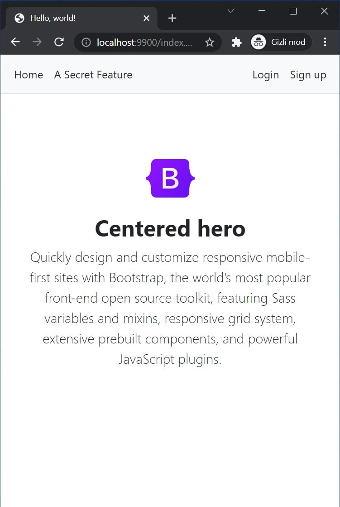
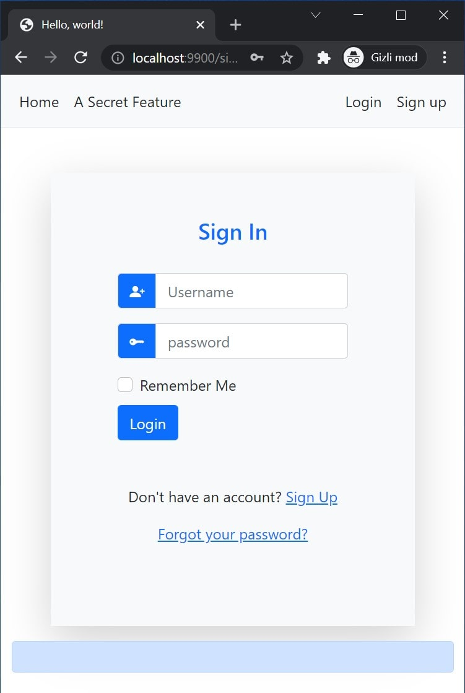
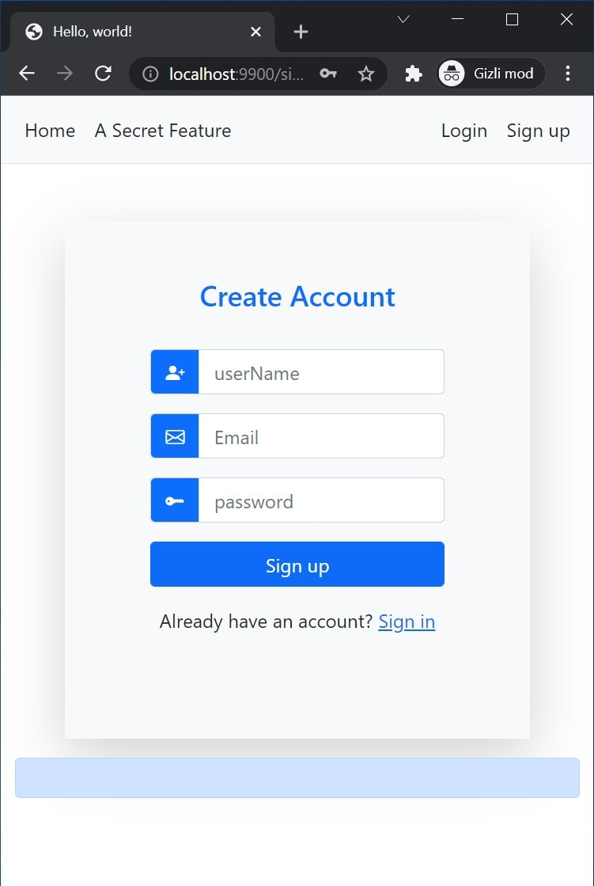
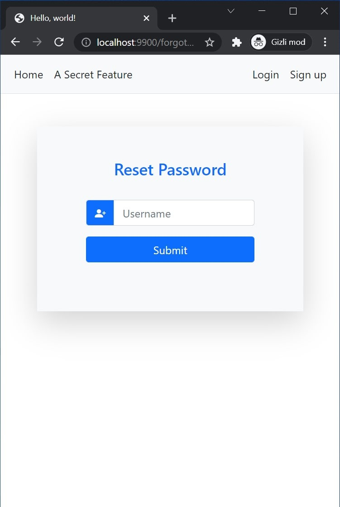
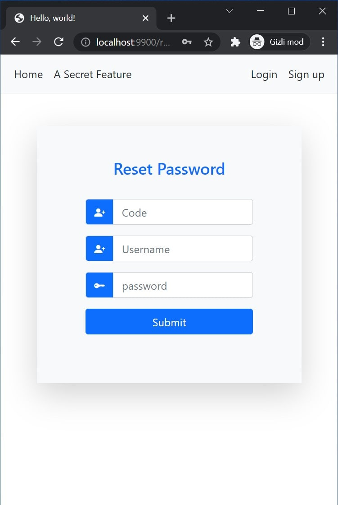
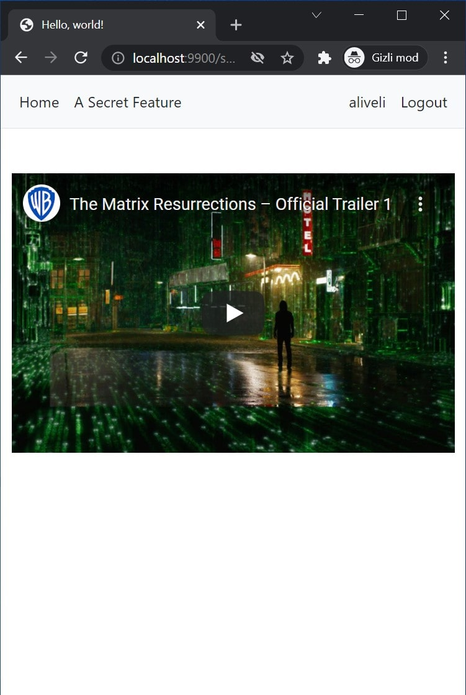

# AWS Cognito Application

- Sign up
- Sign in
- Sign up confirmation
- Logout
- Forgotten password
- Reset password
- Protected page
- Encrypting access token with `illuminate/encryption`

## Installation

    mkdir AWS-Cognito-PHP-Application
    cd AWS-Cognito-PHP-Application
    git clone git@github.com:mahmutbayri/AWS-Cognito-PHP-Application.git .
    composer install
    cp .env.example .env

## Test server
    
    php -S 0.0.0.0:9900 -t public

http://localhost:9900/index.php

## Screenshots

### Landing page

### Sign in page

### Sign up page

### Password reset page

### Password reset confirmation page

### Secret page

